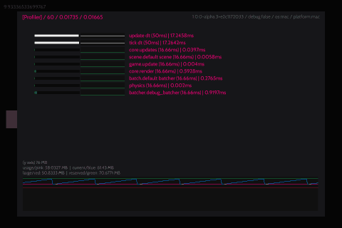

# luxe-gifcapture
A luxe wrapper over the gifcapture library to simplify capturing realtime gifs from in game.



### Requirements

- [gif](https://github.com/snowkit/gif)
- [gifcapture](https://github.com/snowkit/gifcapture)

Requires cpp target (due to gifcapture being threaded atm).

### Install

If you need the dependencies:   
`haxelib git gif https://github.com/snowkit/gif`   
`haxelib git gifcapture https://github.com/snowkit/gifcapture`   

Then setup this library:   
`haxelib git luxe_gifcapture https://github.com/underscorediscovery/luxe-gifcapture`

Add all of them to your flow file:

```js
build : {
  dependencies : {
    luxe : '*',
    gif : '*',
    gifcapture : '*',
    luxe_gifcapture : '*',
  }
},
```

### Usage

See `tests/test_luxe/`

Create a capture instance, along with options and oncomplete handler:
The test example uses the [linc_dialogs](https://github.com/snowkit/linc_dialogs) library to open a save dialog to write the file.

```haxe
capture = new LuxeGifCapture({
    width: Std.int(Luxe.screen.w/4),
    height: Std.int(Luxe.screen.h/4),
    fps: 50, 
    max_time: 5,
    quality: GifQuality.Worst,
    repeat: GifRepeat.Infinite,
    oncomplete: function(_bytes:haxe.io.Bytes) {
        var path = Dialogs.save('Save GIF');
        if(path != '') sys.io.File.saveBytes(path, _bytes);
    }
});
```

Toggle recording:
(Note, you can record and pause as many times as you wish before committing the frames)

```haxe
if(keycode == Key.space) {

    if(capture.state == Paused) {
        capture.record();
        trace('recording: active');
    } else if(capture.state == Recording) {
        capture.pause();
        trace('recording: paused');
    }

}
```

When done recording, call commit and then the callback will be called when it's finished encoding. It will display a colored progress bar while it's busy encoding in the background.

### Notes

This library listens to the internal luxe events `tickstart`/`tickend` - the very start and end of the luxe frame. 

When you create an instance of this library, it swaps out what the engine 'default framebuffer' means - by replacing the default framebuffer with a render target of the same size. 

When the frame starts, it ensures this framebuffer is active, then at the end of the frame, renders this framebuffer to the default framebuffer, so you shouldn't notice any difference. It does for a few reasons: it wants the full frame in a single bindable texture, so it can be cheaply rendered to a smaller target texture. This allows it to correctly resolve multisamples (antialiasing), apply texture filtering, and cheaply downsize/upsize the pixels in one go. This reduces the amount of bandwidth back and forth between ram/GPU as well, by using the GPU to copy it across. 

By rendering, instead of blitting, it's also more portable and works on ES2/WebGL like targets. When gifcapture supports non-threaded mode (soon) this should allow this to work on all current luxe targets.

It then sends the pixels of the destination texture to the gifcapture library for encoding!

